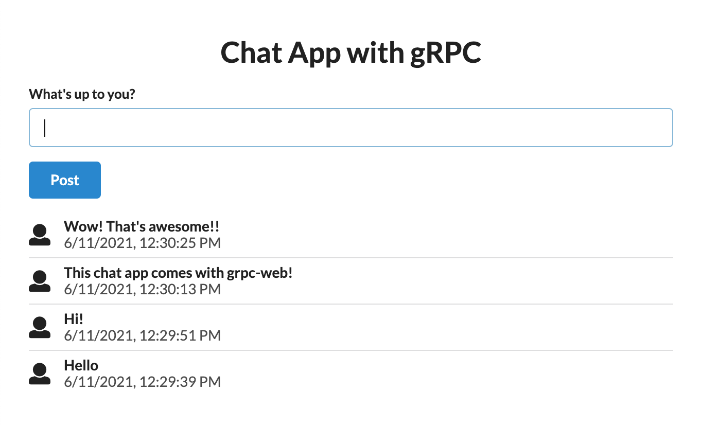
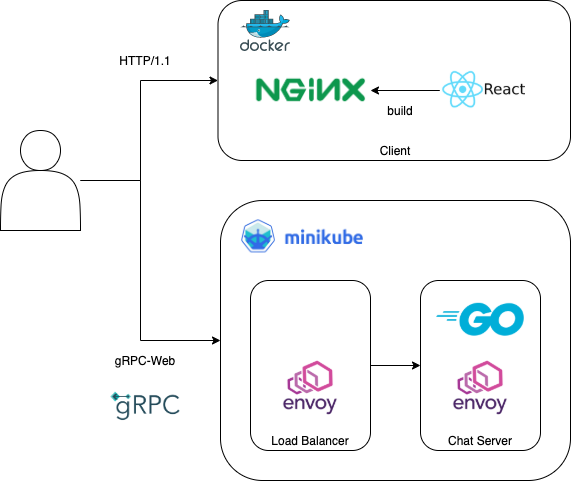

# Chat App with gRPC

This simple chat app covers these technologies.

- gRPC
- gRPC-Web
- Envoy
- Kubernetes

I hope this project will help you to understand how they work.

## How the Chat App Looks Like?



## Architecture



## How to Start?

You can run the client app and the chat server on your local machine.

macOS is highly recommended.

- Required Commands
  - `minikube`
  - `kubectl`
  - `make`
  - `awk` (usually pre-installed on macOS and Linux)
  - `docker-compose`
  - `yarn` or `npm`
- Optional
  - `python`
    - To use `python_grpc_client` instread of `grpcurl`
    - [Quick start | Python](https://grpc.io/docs/languages/python/quickstart/) 
    - `pip install grpcio grpcio-tools`
  - `grpcurl`
    - `curl` for gRPC

```bash
# Make sure you're in the root directory of this project!!

# Start K8s Server
# - "minikube start"
# - "kubectl apply"
$ make k8s.apply

# Open another terminal window
# because $ minikube tunnel runs foreground!!

# Get an Access to LoadBalancer Service
# This runs foreground.
$ minikube tunnel

# In another terminal, run the commands below.

# Start Client App
$ make c.start

# Go to http://localhost
# The following command is available on macOS.
# On the other OS, you just have to open a browser.
$ open http://localhost
```

## Stop Servers

```bash
# Stop Client App
$ make c.stop

# In the "minikube tunnel" terminal, hit Ctrl-c.
# Password will be required again.

# Delete minikube after "kubectl delete"
$ make m.delete
```

## Useful Commands

```bash
# Connect to LoadBalancer Serices
# Password is the same as the login password.
$ minikube tunnel

# Check the IP Address of the LB Services
# CLUSTER-IP of lb-service is what we want.
# If it's <pending>, you might not have run "$ minikube tunnel".
$ kubectl get svc 
# [stdout]
# NAME                  TYPE           CLUSTER-IP      EXTERNAL-IP    PORT(S)                        AGE
# chat-server-service   ClusterIP      10.106.74.122   <none>         10000/TCP,10001/TCP            25m
# lb-service            LoadBalancer   10.107.70.75    10.107.70.75   80:31793/TCP,10001:31858/TCP   25m

# Tail Logs of the Pods with the Label of "app: chat-server"
# and the Container Name of "chat-server"
$ kubectl logs -l app=chat-server -c chat-server --tail=200 -f
```
